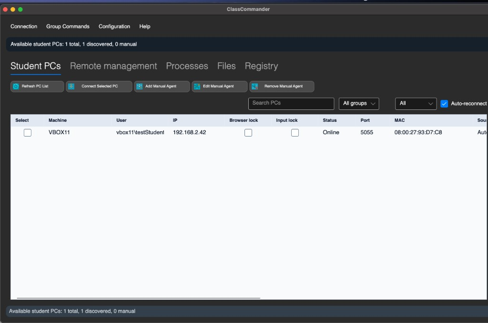
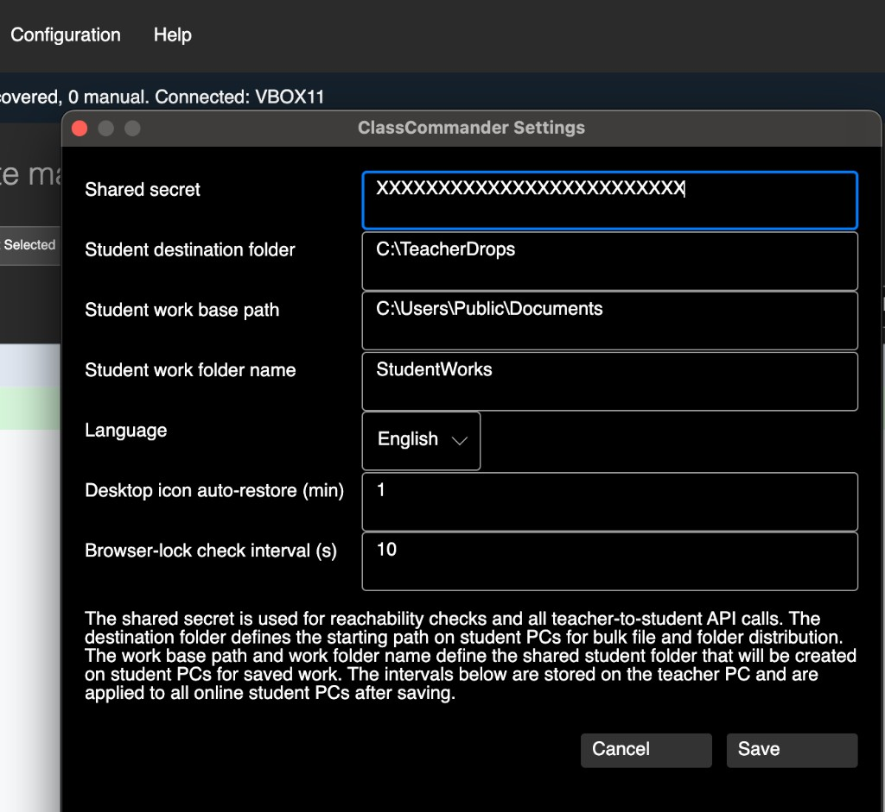
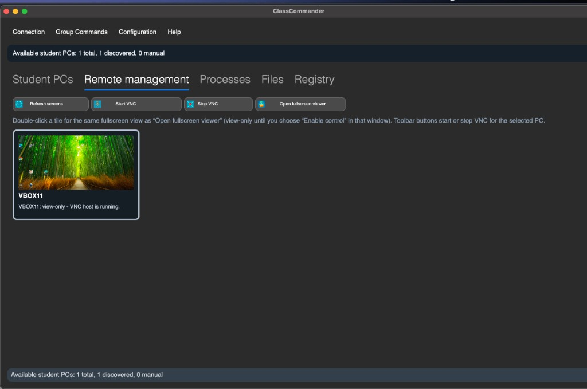
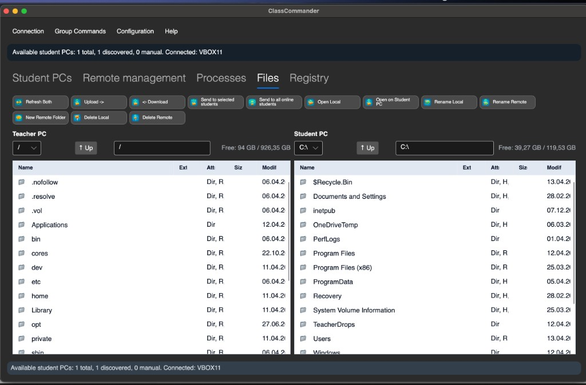
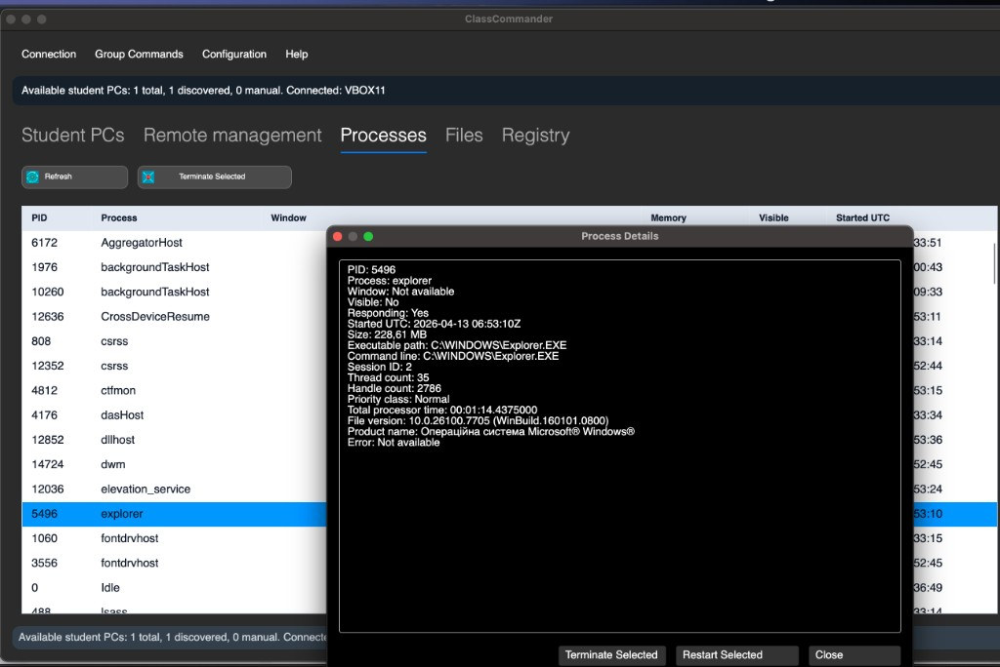
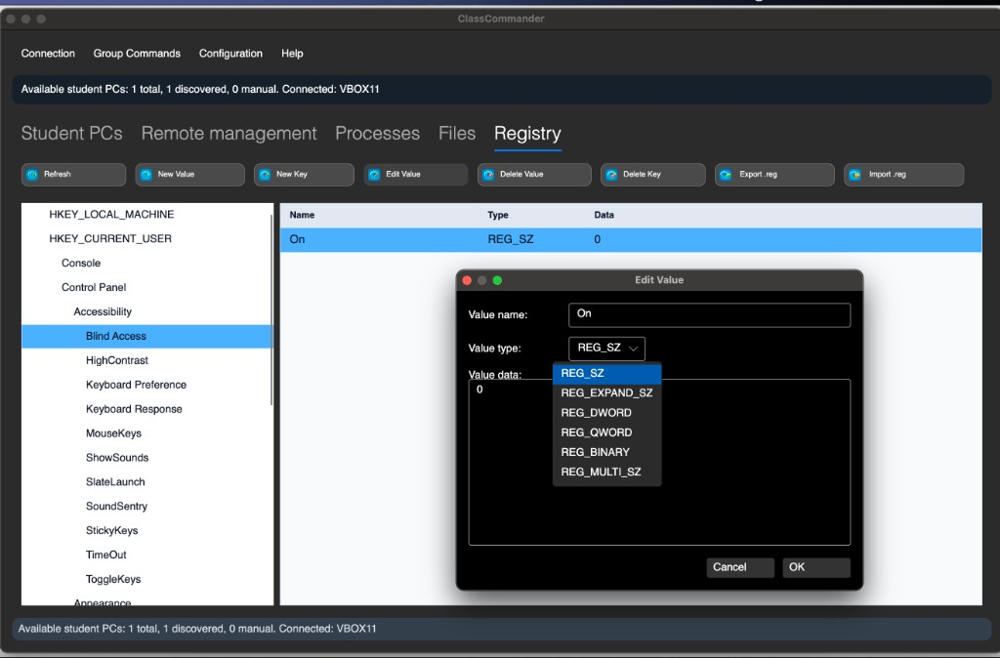
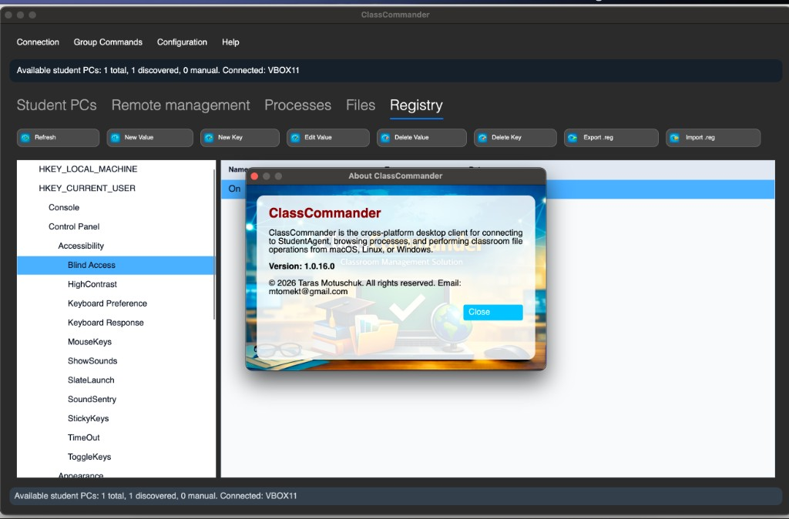

# ClassCommander — classroom management (teacher + student PCs)

[](https://github.com/TarasMotuschuk/teacher-server/actions/workflows/ci.yml)
[](https://github.com/TarasMotuschuk/teacher-server/actions/workflows/release-all.yml)
[](https://github.com/TarasMotuschuk/teacher-server/releases/latest)
[](https://learn.microsoft.com/dotnet/csharp/)
[](https://dotnet.microsoft.com/)
[](https://avaloniaui.net/)
[](#)

`ClassCommander` is a **teacher-controlled classroom administration** solution for Windows student PCs, with:

- a Windows service + session UI on the student PC (`StudentAgent.*`)
- a legacy maintenance-only teacher client on Windows (`TeacherClient`, WinForms)
- a primary teacher client on macOS/Linux/Windows (`TeacherClient.Avalonia`, Avalonia)

This project keeps an explicit safety boundary: **visible, authorized classroom administration only** (no stealth monitoring, hidden persistence, or covert control flows).

## Table of contents

- [Screenshots](#screenshots)
- [What you can do](#what-you-can-do)
- [How it works](#how-it-works)
- [Quick start](#quick-start)
  - [Student PCs (Windows)](#student-pcs-windows)
  - [Teacher PC (Windows)](#teacher-pc-windows)
  - [Teacher PC (macOS/Linux/Windows)](#teacher-pc-macoslinuxwindows)
- [Configuration](#configuration)
- [Repository structure](#repository-structure)
- [Release workflow](#release-workflow)

## Screenshots

Avalonia teacher client (macOS example):









## What you can do

### Teacher workflows (high level)

- **Discover student PCs** on the LAN (UDP), or add PCs manually (IP/port/group/notes).
- **Connect** to a selected student PC, with optional **auto-reconnect**.
- **Remote management**: start/stop the student VNC host, view screens, open a fullscreen viewer (view-only until control is enabled in the viewer).
- **Processes**: list processes, view details, terminate and restart.
- **Files**: dual-pane local + remote browsing, upload/download, rename, delete, open on the student PC.
- **Group commands** (selected PCs or all online PCs):
  - file distribution, destination-folder clear
  - remote command scripts (run as current user or administrator)
  - collect student work folders
  - browser lock and input lock (including a visible demonstration banner mode)
  - power actions (shutdown/restart/log off)
  - **Group Policies** (registry-based classroom restrictions + optional enforced wallpaper)
  - desktop icon layout actions (save/restore on the connected PC; restore or push layouts in bulk)

## How it works

### Components

- **Student PC (Windows)**
  - `StudentAgent.Service`: privileged Windows Service host for API + policy enforcement.
  - `StudentAgent.UIHost`: visible session UI (tray, dialogs, visible overlays/banners).
  - `StudentAgent.VncHost`: session-aware VNC host for visible remote viewing/control.
- **Teacher PC**
  - `TeacherClient`: legacy maintenance-only Windows Forms teacher client.
  - `TeacherClient.Avalonia`: primary cross-platform teacher client (macOS/Linux/Windows).
- **Shared**
  - `Teacher.Common`: DTOs and API contracts shared between teacher and student.

### Transport & auth

- **Transport**: HTTP
- **Discovery**: UDP discovery (student service responds with identity + endpoints)
- **Auth**: a shared-secret header (configured on teacher + student)

## Quick start

### Student PCs (Windows)

1. Install **ClassCommander** on student PCs using the **Windows MSI** (feature: *Student workstation tools*).
2. Ensure the student PCs are on the same network as the teacher PC.

### Teacher PC (Windows)

1. Install **ClassCommander** on the teacher PC using the **Windows MSI** `ClassCommander.Setup.msi` (feature: *Teacher workstation tools*).
2. Open `Configuration → Basic Settings` (or `Connection → Settings`, depending on client) and set:
   - UI language
   - **shared secret** (must match student PCs)
   - **student destination folder**
   - **student work base path** and **student work folder name**
   - desktop icon auto-restore interval and browser-lock check interval (optional)
3. Go to **Student PCs**, select a PC, and click **Connect Selected PC**.

### Teacher PC (macOS/Linux/Windows)

Run the Avalonia client:

```bash
dotnet restore TeacherClient.Avalonia/TeacherClient.Avalonia.csproj
dotnet run --project TeacherClient.Avalonia/TeacherClient.Avalonia.csproj
```

Build macOS installer:

```bash
cd TeacherClient.Avalonia.Setup
bash ./Build-MacInstaller.sh
```

This produces `TeacherClient.Avalonia.Setup/dist/ClassCommander.Setup.pkg`.

## Configuration

ClassCommander is configured from the teacher client UI.

### Basic settings window

Fields (teacher side):

- **Shared secret**: must match the student PCs. Used for reachability checks and all teacher→student API calls.
- **Student destination folder**: base folder on student PCs used for bulk file/folder distribution.
- **Student work base path** + **Student work folder name**: location used for provisioning and collecting student work folders.
- **Language**: UI language (English / Ukrainian).
- **Desktop icon auto-restore (min)**: student desktop icon auto-restore interval.
- **Browser-lock check interval (s)**: how often student PCs check and enforce browser lock.

For deep technical notes (endpoints, update manifests, release artifacts), see `README.dev.md`.

## Repository structure

```text
TeacherServer.sln
Teacher.Common/
StudentAgent.Shared/
StudentAgent.Service/
StudentAgent.UIHost/
StudentAgent.VncHost/
StudentAgent.Updater/
TeacherServer.Setup/
TeacherClient/
TeacherClient.Avalonia/
TeacherClient.Avalonia.Setup/
Branding/
docs/
AGENTS.md
CHANGELOG.md
README.md
```

## Release workflow

- Releases are driven by GitHub Actions on tag push (see workflows).
- Windows MSI builds live under `TeacherServer.Setup/` and produce `ClassCommander.Setup.msi`.
- macOS packaging lives under `TeacherClient.Avalonia.Setup/` and produces `ClassCommander.Setup.pkg`.

See `AGENTS.md` for repo rules and the Windows release script conventions.
